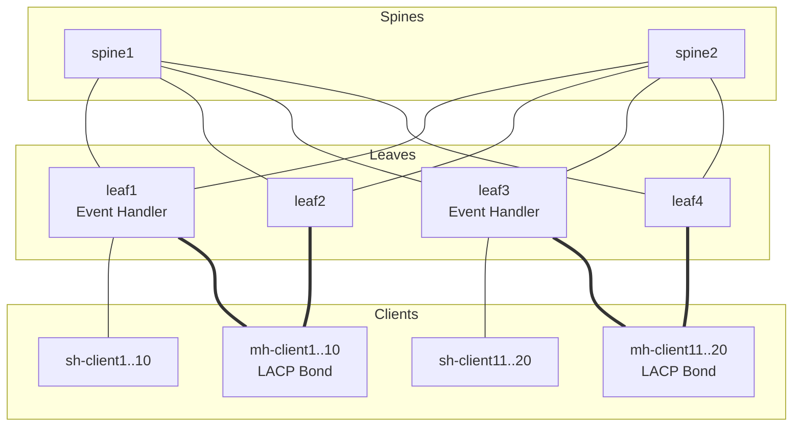

# SR Linux Dynamic Subinterface & EVPN Convergence Test Harness

This repository contains a test harness designed to evaluate and measure the performance of **Nokia SR Linux (SRL) Dynamic Subinterfaces** in an EVPN-VXLAN fabric. 

The primary objective is to measure the convergence latency (time from first packet/ARP trigger to active end-to-end data plane connectivity) when subinterfaces, mac-vrfs, and VXLAN/EVPN configurations are dynamically instantiated on the leaf nodes in response to client traffic.

---

## Architecture & Topology

The topology is defined in [topology.clab.yml](file:///home/wds/github/srl-evpn-topo/topology.clab.yml) and consists of a 2-spine, 4-leaf fabric interconnecting 40 Linux client containers.



### Components
1. **SR Linux Fabric**:
   - **Spines (`spine1`, `spine2`)**: Serve as BGP EVPN Route Reflectors.
   - **Leaves (`leaf1` to `leaf4`)**: Run SR Linux. `leaf1` and `leaf3` host single-homed clients. `leaf1`/`leaf2` and `leaf3`/`leaf4` form MC-LAG (ESIs) for multi-homed clients.
   - **Dynamic Subinterface Event Handler**: A MicroPython event script executing on the leaves. It monitors ports for active VLAN tags and dynamically configures/deconfigures corresponding subinterfaces, MAC-VRF network instances, and VXLAN tunnel interfaces on demand. All four leaves run the customized `dyn_subif_custom.py` (the stock `dynamic-subinterfaces.py` is kept only as a reference copy). See [Dynamic Subinterface Event Handler](#dynamic-subinterface-event-handler) below.
2. **Linux Clients**:
   - **Single-homed (`sh-client1`..`20`)**: Connected via a single interface (`eth1`).
   - **Multi-homed (`mh-client1`..`20`)**: Connected via an LACP `bond0` interface spread across leaf pairs for active-active redundancy.

---

## Dynamic Subinterface Event Handler

The core of the fabric's on-demand provisioning is a MicroPython event-handler script run by the SR Linux event manager. When VLAN tags are detected as active on a client-facing port (`active-vlan-detection`), the handler instantiates — and later tears down — the matching `subinterface`, a per-VLAN `mac-vrf` network-instance (`VLAN-<id>`), a VXLAN tunnel-interface, and the BGP-EVPN/BGP-VPN config. Work is applied in batches (`VLAN_BATCH_SIZE = 10` per `REINVOKE_DELAY_MS = 100` ms) and state is persisted between invocations so add/remove deltas are computed correctly.

For each VLAN the subinterface, MAC-VRF network-instance (`VLAN-<id>`), and `vxlan0` vxlan-interface are emitted into a **single list of config actions per invocation**, so they are applied in **one atomic transaction** (up to 10 VLANs per commit). This is enforced by the config itself: the MAC-VRF references `vxlan0.<id>` before that vxlan-interface is created later in the same list, so the set only passes validation if it commits together. A subinterface therefore never exists without its MAC-VRF and VXLAN having been created in the same commit — which is why a single subinterface timestamp is a faithful proxy for all three (see [Measuring setup rate from the switch](#measuring-setup-rate-from-the-switch-recommended)).

Two scripts ship in this repo:

| Script | Origin | Used by | Mounted at |
|--------|--------|---------|------------|
| `dynamic-subinterfaces.py` | Stock, extracted verbatim from the SR Linux image | none (reference copy only) | — |
| `dyn_subif_custom.py` | Customized fork of the stock script; adds VLAN exclusion + consistent route-targets | **all four leaves** | `/etc/opt/srlinux/eventmgr/` |

All leaves run `dyn_subif_custom.py` so route-target handling is identical fabric-wide (see [`rt-asn`](#the-rt-asn-option-consistent-route-targets)); the `exclude-vlans` option is set on `leaf1` only.

### Custom script: `dyn_subif_custom.py`

`dyn_subif_custom.py` is a drop-in extension of the stock handler that adds two capabilities: **excluding specific VLANs from dynamic creation**, and **pinning the EVPN route-targets to a fabric-wide value** so dynamic MAC-VRFs actually exchange routes across leaves.

#### VLAN exclusion

Excludes specific VLANs from dynamic creation even when they are reported active within an interface's configured `dynamic-subinterfaces vlan-range`.

**Why:** the `vlan-range` on an interface is a single contiguous low/high band, and there is no native way to punch holes in it — e.g. to reserve a few IDs inside the band for static config, or to keep a noisy VLAN from ever being auto-provisioned. The `exclude-vlans` option provides that blocklist without having to narrow or fragment the range.

**Behaviour:** excluded VLANs are subtracted from the desired set *before* any config is generated, so they are never instantiated. A VLAN that is already provisioned and is *later* added to the exclusion list is treated as no-longer-desired and torn down through the handler's normal remove path (subinterface, mac-vrf, and VXLAN interface all removed). Everything else — batching, persistence, multi-interface reference counting — is unchanged from the stock script.

#### The `exclude-vlans` option

The handler reads one new option from its event-handler config:

| Option | Value | Meaning |
|--------|-------|---------|
| `exclude-vlans` | comma-separated IDs and/or inclusive `low-high` ranges, e.g. `1002,1010-1019` | VLAN IDs to never auto-create. The token `untagged` (or `0`) excludes the untagged subinterface. |

Both event-handler option encodings are accepted: a scalar `value` (parsed as a comma-separated string) or a `values` leaf-list (serialized to the script as a JSON array; each element may itself be a single ID or a range). Blank/malformed tokens are skipped rather than aborting the handler, so one typo cannot disable dynamic provisioning entirely.

#### The `rt-asn` option (consistent route-targets)

Each dynamically-created MAC-VRF needs import/export route-targets so EVPN can advertise its MACs to the other leaves. If you leave route-targets unset, SR Linux **auto-derives** them as `<local-BGP-AS>:<EVI>`. This fabric uses an **eBGP overlay**, so every leaf has a *different* local AS — the auto-derived RT therefore differs per leaf, imports never match, and dynamic VLANs **never exchange MAC/IMET routes across leaves** (each leaf sees its own local MACs only; cross-leaf traffic black-holes).

To fix this, the handler sets the route-target explicitly as `target:<rt-asn>:<EVI>`, where `rt-asn` is a static, ASN-independent administrator value that is identical on every leaf:

| Option | Value | Meaning |
|--------|-------|---------|
| `rt-asn` | integer (default `65535`) | administrator field of the import/export route-target `target:<rt-asn>:<EVI>`. **Must be the same on every leaf.** |

Leaving it at the default is fine as long as all leaves run this script (they do). The value is arbitrary — it is only the RT's administrator field, unrelated to any real BGP AS — but it must be consistent fabric-wide.

#### Deployment in this repo

The custom script is bound into **every leaf** under the writable event-manager directory and referenced by **basename** — SR Linux resolves `upython-script` from both `/etc/opt/srlinux/eventmgr/` and `/opt/srlinux/eventmgr/`:

```yaml
# dyn-vlan.clab.yml — same bind on leaf1..leaf4
  leaf1:
    kind: nokia_srlinux
    binds:
      - ./dyn_subif_custom.py:/etc/opt/srlinux/eventmgr/dyn_subif_custom.py
```

Each leaf's startup config (`configs/leafN.cfg`) points the handler at it; `rt-asn` defaults to `65535` so it is not set explicitly. Only `leaf1` additionally carries the exclusion list:

```
set / system event-handler instance dyn-subif upython-script dyn_subif_custom.py
set / system event-handler instance dyn-subif paths [ "interface ethernet-1/{1..10} dynamic-subinterfaces active-vlans" ]
set / system event-handler instance dyn-subif options object exclude-vlans value 1002,1010-1019   # leaf1 only
```

To change the excluded set at runtime:

```bash
docker exec -i leaf1 sr_cli <<'EOF'
enter candidate
system event-handler instance dyn-subif options object exclude-vlans value "1002,1010-1019,2000-2010"
commit stay
EOF
```

> [!NOTE]
> Because the script is bind-mounted as a single file, editing it on the host can replace the file's inode, which the running container will not see. To push an edit into a live node without redeploying, write it into the mounted inode in place:
> `docker exec -i leaf1 sh -c 'cat > /etc/opt/srlinux/eventmgr/dyn_subif_custom.py' < ./dyn_subif_custom.py`. A `clab deploy --reconfigure` re-establishes the mount cleanly.

#### Verifying exclusion

Trigger a mix of excluded and allowed VLANs from a client on leaf1 and confirm the excluded ones are *detected active* but never provisioned. With `exclude-vlans 1002,1010-1019`:

```bash
# From sh-client1 (leaf1 ethernet-1/1), bring up VLANs 1000,1001,1002,1010,1015,1020, then:
docker exec leaf1 sr_cli "info from state interface ethernet-1/1 dynamic-subinterfaces active-vlans"
#   -> all six VLANs listed (the leaf detects them)
docker exec leaf1 sr_cli "info interface ethernet-1/1 subinterface *" | grep -E "subinterface [0-9]+"
#   -> only 1000, 1001, 1020 created; 1002/1010/1015 excluded
```

The excluded VLANs appear in `active-vlans` (detection happens upstream of the handler) but no subinterface, `VLAN-<id>` mac-vrf, or VXLAN interface is created for them — proving the filtering happens in the handler itself.

---

## vMotion Emulation

[vmotion.py](file:///home/wds/github/srl-dyn-vlans/vmotion.py) (with the in-container announcer [rarp_agent.py](file:///home/wds/github/srl-dyn-vlans/rarp_agent.py)) emulates a VMware vSphere **vMotion**: a "VM" — a fixed MAC + IP on a VLAN — moves from a source client/leaf-port to a target client/leaf-port and, exactly like ESXi, announces its new location with a gratuitous **RARP** (EtherType `0x8035`). It answers the question *"is the RARP sufficient when the VLAN may not yet exist on the target leaf?"* by timing, relative to the cutover (`t0`), when the target leaf provisions the sub-interface, when the VM MAC becomes local there, and when the source leaf releases it (EVPN mobility) — plus the dataplane outage seen by a stationary peer.

```bash
# Cross-leaf move (leaf1 -> leaf3) with a stationary peer on leaf1 (no flush — realistic):
./vmotion.py --vlan 1060 --src sh-client1 --dst sh-client11 --peer sh-client5
# Show the single-RARP failure mode instead:
./vmotion.py --vlan 1061 --src sh-client1 --dst sh-client11 --rarp-mode once
```

Key options: `--rarp-mode {once,burst,sustained}` (default `sustained`); `--peer <client>` (measure outage); `--vlan/--src/--dst`; `--flush-source-leaf` (force source-leaf teardown — *not* realistic, see below); `--json-report`.

### Two things a bare RARP does **not** solve on dynamic sub-interfaces

1. **The RARP is consumed as the active-VLAN trigger, not forwarded.** The first tagged frame on a cold target port is what *triggers* dynamic provisioning; it arrives before the sub-interface/MAC-VRF exist and is dropped. A real single-shot vMotion RARP is therefore lost — the tool counts how many RARPs land "before subif existed". You need **sustained** announcement (or continued VM traffic) spanning the ~0.2–1 s provisioning window; `--rarp-mode once` reproduces the failure.
2. **The source leaf keeps the VM MAC local — mobility must *out-compete* it, not flush it.** Deleting the VM from the source *host* does not bring down the source *leaf's* dynamic sub-interface — it persists under the `retention-timer` (10 min here) — so the source leaf keeps a **local** MAC entry that ages normally (~5 min; it is *not* frozen by MAC-duplication). EVPN mobility resolves this by traffic: **the moved VM must keep sourcing frames on the target** so the target re-asserts the MAC as local and wins the mobility arbitration, at which point the source leaf flips the entry to remote (`evpn`, vtep = target). If the VM instead goes quiet right after the move, the source's still-aging local entry wins and the *target yields to remote* — both leaves then point back to the source and peers black-hole until the source entry ages out (~5 min). A real migrated VM keeps sending, so a cross-leaf move **converges on its own in ~6–13 s with no source-side action** — the tool sustains the announcement through the whole mobility phase to model this. `--flush-source-leaf` deletes the source leaf sub-interface to force the release instantly, but that is **not realistic**: an ESXi trunk port stays up when a single VM leaves. Use it only to contrast against the realistic (no-flush) path.

> The RARP is also useless across leaves unless route-targets match — which is exactly what the [`rt-asn`](#the-rt-asn-option-consistent-route-targets) fix guarantees. With matched RT + sustained announcement (the moved VM continuing to source traffic), a cross-leaf move converges in the control plane in ~6–13 s with **no flush**, the dataplane outage being that provisioning + mobility-arbitration window.

---

## How the Convergence Test Works

```
[Client 1] --(First Tagged Frame/ARP)--> [Leaf 1] --(Trigger Event Handler)--> [Instantiate Subif & VRF]
                                                                                     |
                                                                             [EVPN Route Sync]
                                                                                     |
[Client 2] <-------------------(Data Traffic Flowing)----------------------- [Leaf 3 dynamically sets up path]
```

1. **Pre-configuration**: VLAN subinterfaces are configured on the Linux clients. Crucially, IPv6 is disabled on these interfaces to prevent unsolicited DAD (Duplicate Address Detection), Router Solicitations, or MLD traffic from keeping the leaf's dynamic interfaces in a "warm" state.
2. **Cold State**: On the switch side, no dynamic subinterfaces exist.
3. **Traffic Generation**: The script initiates high-frequency UDP traffic flow between client pairs.
4. **Trigger**: The first packet (usually an ARP request) triggers active VLAN detection on the leaf interface.
5. **Dynamic Setup**: The switch event handler dynamically instantiates the subinterface, MAC-VRF, and VXLAN interfaces. BGP EVPN then exchanges MAC routes across the fabric.
6. **Measurement**: The traffic agent measures the delta between the time the first packet was sent and when the first packet is successfully received by the remote endpoint. The number of lost packets multiplied by the sending interval defines the convergence outage window.

---

## Installation & Setup

### 1. Deploy the Topology
Deploy the network fabric using [containerlab](https://containerlab.dev/):
```bash
sudo clab deploy -t topology.clab.yml
```

### 2. Configure Client VLANs
Use the VLAN configuration script to provision subinterfaces on the client containers.

```bash
# Set up VLANs 1000 to 1010 on single-homed clients
./configure_vlans.py setup --vlans 1000-1010 --clients sh
```

> [!NOTE]
> [configure_vlans.py](file:///home/wds/github/srl-evpn-topo/configure_vlans.py) automatically disables IPv6 on all configured subinterfaces inside the client containers. This ensures they remain quiet and do not refresh MAC tables or reset leaf retention timers prematurely.

### 3. Host & Client Network Tuning

#### Disabling IPv6 (Avoiding Unsolicited Neighbor Solicitations)
By default, Linux brings up interfaces with IPv6 enabled and automatically transmits:
- **Duplicate Address Detection (DAD)** multicast messages.
- **Router Solicitations (RS)** to discover local routers.
- **Neighbor Solicitations (NS)** and MLDv2 listener reports.

This background traffic triggers active-VLAN detection on the SR Linux leaf switches, preventing the dynamic subinterfaces from ever timing out and de-instantiating. To keep client interfaces quiet, the setup script disables IPv6 for each VLAN subinterface via `sysctl`:
```bash
# Executed inside the client container:
echo 1 > /proc/sys/net/ipv6/conf/eth1.<VLAN>/disable_ipv6
```

#### ARP Table Scaling (High-VLAN Environments)
When running tests with many subinterfaces and destination endpoints, the Linux kernel's ARP (neighbor) table limits are exceeded, causing unresolved neighbors and packet drops. This is a very common cause of "outage on a set of VLANs" that is **not** a switch problem — the leaf sub-interfaces are up, but the clients cannot resolve ARP for a subset of peers, so those flows black-hole.

> [!IMPORTANT]
> These thresholds **must be set in the host root network namespace**, not inside the
> client containers. The kernel's `arp_tbl` entry count (`gc_thresh3`) is effectively
> **global across every container** sharing the host, and the per-container netns is
> read-only for these keys — running `sysctl -w net.ipv4.neigh.default.gc_thresh*`
> *inside* a client fails with `cannot stat .../neigh/default/gc_thresh`. With ~40
> clients × hundreds of subinterfaces the shared table blows past the default
> `gc_thresh3=1024` and you will see `neighbour: arp_cache: neighbor table overflow!`
> in `dmesg`.

Set them on the **host** (root namespace), before or during the test:
```bash
# On the HOST (not inside a container). Persist via /etc/sysctl.d/99-clab-arp.conf
sudo sysctl -w net.ipv4.neigh.default.gc_thresh1=4096
sudo sysctl -w net.ipv4.neigh.default.gc_thresh2=8192
sudo sysctl -w net.ipv4.neigh.default.gc_thresh3=16384
```
To confirm you are hitting this limit: `dmesg | grep 'neighbor table overflow'`, and
watch the global count vs. threshold in `cat /proc/net/stat/arp_cache` (first column,
hex) against `sysctl net.ipv4.neigh.default.gc_thresh3`.

---

## Running Traffic Tests

The [run_traffic.py](file:///home/wds/github/srl-evpn-topo/run_traffic.py) script orchestrates the end-to-end test run by deploying lightweight listener agents in the client containers, initiating UDP traffic, collecting logs, and calculating loss/outage periods.

### Command Options
- `--vlans`: Range of VLANs to test (e.g. `1000-1005` or `1000,1002`).
- `--interval`: Sending interval in seconds (default: `0.01` i.e. 10ms / 100pps). Lower intervals yield more precise convergence metrics.
- `--duration`: Total run duration in seconds (default: `10.0`). Must be long enough for the leaves to finish instantiating **every** subinterface (see [Choosing a duration](#choosing-a-duration-for-large-vlan-counts)).
- `--intraswitch`: Test intra-leaf client pairs (e.g. `sh-client1` <-> `sh-client2` on `leaf1`) instead of cross-fabric pairs (e.g. `sh-client1` <-> `sh-client11`).
- `--clients`: Filter clients by prefix (`sh` or `mh`).
- `--unidirectional`: Measure unidirectional convergence instead of default bidirectional traffic. **See the caveat below** — this only produces meaningful numbers against an already-warmed fabric.
- `--no-setup`: Skip configuring client subinterfaces (useful if they are already pre-configured).
- `--force`: Override the safety guards (cold unidirectional refusal and the short-duration warning). Use only when you understand the consequences.

### Interactive Flow Selection
When run from a terminal, the script opens an interactive menu so you can toggle exactly which flows to test before the run starts:

- Press a flow's **letter/number** to toggle it on/off.
- `[s]` select all, `[d]` deselect all.
- `[<]` / `[>]` scroll when the flow list is taller than your terminal window (the header shows e.g. `showing 4-13 of 20`). The list auto-scrolls to a flow when you toggle it.
- `[Enter]` start the test (requires at least one flow selected), `[q]` cancel.

In a non-interactive/piped session the menu is skipped and **all** flows are activated automatically.

### Example Run
To run a test across VLANs 1000 to 1002 at 10ms intervals:
```bash
./run_traffic.py --vlans 1000-1002 --interval 0.01 --duration 15 --clients sh
```

### Choosing a Duration for Large VLAN Counts
The leaf event handler instantiates subinterfaces in **batches** (10 subinterfaces per ~100 ms per leaf). The busiest leaf must configure `ports × VLANs` subinterfaces, so with many VLANs (or many client pairs on one leaf) setup can take tens of seconds. If `--duration` ends before a VLAN's subinterface is up, that VLAN is reported as a **100% outage even though the switch was still working** — a "test too short" artifact, not a switch failure.

The script estimates a lower bound on setup time and warns (with a recommended `--duration`) when your value looks too short. As a rule of thumb, allow at least `ceil(ports × VLANs / 10) × 0.1s` plus headroom for EVPN propagation. Example for 1000 VLANs on a single pair:
```bash
./run_traffic.py --vlans 1000-1999 --duration 25 --clients sh
```

> [!NOTE]
> **Why `--unidirectional` needs `--no-setup`:** from a cold fabric, a one-way flow `A -> B` cannot converge. The far leaf only instantiates `B`'s client subinterface/MAC-VRF once `B` itself sources a tagged frame, but the receiver stays silent (IPv6 disabled, no gratuitous ARP). The egress path is therefore never built and `A -> B` is black-holed (~100% loss). This is a topology artifact, not a convergence measurement, so the script refuses cold unidirectional runs unless you pass `--no-setup` (pre-warmed fabric) or `--force`.

### Cold vs. Warm State and Resetting Between Tests
The `retention-timer` on each client-facing interface is the **inactivity period, in
minutes** (SR Linux `dynamic-subinterfaces retention-timer`, `units "minutes"`, default
`240`), after which an idle VLAN's dynamic config is removed. In this topology it is set
to `10` (i.e. **10 minutes**). A VLAN stays in `active-vlans` — and its subinterface /
MAC-VRF / VXLAN stay provisioned — until 10 minutes after the *last* frame on that VLAN.

> [!IMPORTANT]
> **Bouncing the client-facing interface does _not_ force an immediate teardown.**
> Admin-disabling the port simply stops new frames, which *starts* (does not shortcut)
> the inactivity timer — the dynamic config persists until the retention timer expires.
> (Verified: subinterfaces remain up for the full retention window after an interface
> bounce.) The `tools … dynamic-subinterfaces clear-retention-timer` action would clear
> it instantly, but it is not exposed in all SR Linux releases.

Reliable ways to get a **cold** leaf for a measurement:
- **Use a fresh VLAN range** that has not been triggered within the retention window —
  it is inherently cold (no config exists yet). This is what `measure_setup_rate.py`
  relies on, and it avoids waiting entirely.
- **Wait out the retention timer** (10 minutes idle), or temporarily lower it
  (`set /interface ethernet-1/x dynamic-subinterfaces retention-timer 1`) and wait ~1 min.
- Check current warmth per leaf with `fcli -t topology.clab.yml -o json subif` or
  `sr_cli "show network-instance summary" | grep -c VLAN-`.

### Measuring setup rate from the switch (recommended)
`run_traffic.py` infers convergence from client dataplane loss, which is sensitive to
client ARP tables and host forwarding capacity (see ARP scaling above). To measure the
**switch's** provisioning rate directly — independent of client/host limits — use
[measure_setup_rate.py](file:///home/wds/github/srl-evpn-topo/measure_setup_rate.py),
which triggers active-VLAN detection on a cold range and reads each sub-interface's
`last-change` timestamp via gNMI (`gnmic`):
```bash
./measure_setup_rate.py --node leaf1 --client sh-client1 --vlans 1100-1199
```
The leaf's gNMI management IP is derived automatically from `--node` via `docker inspect`; pass `--leaf-mgmt` only to override it.

Although the tool only reads the **subinterface** `last-change`, the number it reports is
the full **subif + MAC-VRF + VXLAN** provisioning rate: the event handler creates all
three in one atomic transaction (see [Dynamic Subinterface Event Handler](#dynamic-subinterface-event-handler)),
so the subinterface cannot come up without its MAC-VRF and VXLAN having been created in
the same commit. `last-change` is an oper-state (creation) event, so by default it
measures **local provisioning only** — not the cross-leaf EVPN convergence.

**EVPN-tail (inter-switch) mode** (`--dst-node`) adds that second phase. It warms the
same range on a destination leaf/client (so the dst leaf provisions `VLAN-<id>` and can
import the route), then times when each source client's MAC lands in the dst leaf's
`VLAN-<id>` FDB as `type=evpn` — i.e. BGP-EVPN Type-2 propagated and the remote FDB
programmed. It reports the **end-to-end** time (t0 → MAC in dst FDB) and the **EVPN tail**
(that minus the local subif-up time). Unlike the dataplane method this stays clean — no
client ARP / host forwarding — so it isolates the pure control-plane inter-switch tail
(matched route-targets via [`rt-asn`](#the-rt-asn-option-consistent-route-targets) are
required for it to converge):
```bash
./measure_setup_rate.py --node leaf1 --client sh-client1 --vlans 1100-1199 \
    --dst-node leaf3 --dst-client sh-client11
```

> [!IMPORTANT]
> The **requested range** must be cold: `measure_setup_rate.py` reads `active-vlans`
> fabric-wide and refuses to run if any VLAN in `--vlans` is already active (its subifs
> would already exist, making the timing meaningless). Active VLANs **outside** the range
> — e.g. leftovers from a previous run still within their retention window — are allowed;
> the tool notes them and proceeds, since they only share the provisioning pipeline (minor
> contention). Use `--allow-active-vlans` to skip the check entirely.

> [!NOTE]
> Not every requested VLAN necessarily provisions (some may be excluded by the handler,
> outside the `vlan-range`, or missed by detection). The tool stays **agnostic to device
> config** and does not try to predict which: a `--settle` timer stops the wait once
> provisioning stalls (no new subif/FDB entry for that long), so such a range ends promptly
> and lists what did **not** provision (e.g. `Not provisioned: 10 [1010-1019]`) instead of
> blocking until `--max-wait`.
